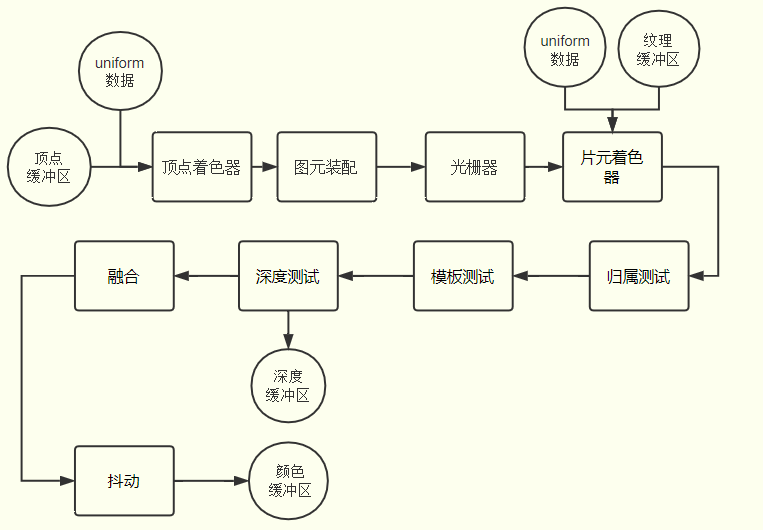

# WebGL 执行流程

## WebGL 坐标系

WebGL 坐标原点默认在画布中间，且画布大小为`-1.0`到`1.0`之间，画布向右为 x 轴正方向，向上为 y 轴正方向，垂直画布向里为 z 轴正方向。可以到[Z 轴默认方向](../3.%20Z%20%E8%BD%B4%E9%BB%98%E8%AE%A4%E6%96%B9%E5%90%91/)中实际观察一下。


## 执行流程

WebGL 执行流程比较多，作为入门，可简单理解为：`初始化 WebGL 上下文 -> 编译着色器代码 -> 创建着色器程序-> 写入数据到缓冲区 -> 执行顶点着色器代码 -> 光栅化 -> 执行片段着色器 -> 绘制到画布上`。

比较完整的流程可以参考[WebGL 零基础入门教程(郭隆邦)](http://www.yanhuangxueyuan.com/WebGL/)中的渲染管线流程图


### 初始化 WebGL 上下文

使用`getContext('webgl')`或者`getContext('webgl2')`获取到 webgl1 或者 webgl2 的上线文对象，后续所有的操作都是在这个上下文中进行的。

```js
const $canvas = document.querySelector('#canvas')
// 初始化 WebGL 上下文
const gl = $canvas.getContext('webgl2')
```

### 编译着色器代码

- 编译顶点着色器

```js
// 创建 vertex shader
const vertexShader = gl.createShader(gl.VERTEX_SHADER)
const vsSource = `
// attribute 声明 vec4 类型变量 a_position
// vec4 前三个值为点的 x,y,z 坐标
attribute vec4 a_position;

void main() {
  // 顶点坐标 a_position 赋值给内置变量 gl_Position
  // 逐顶点处理数据
  gl_Position = a_position;
}`

gl.shaderSource(vertexShader, vsSource)
// 编译顶点着色器
gl.compileShader(vertexShader)
```

- 编译片段着色器

```js
// 创建 fragment shader
const fragmentShader = gl.createShader(gl.FRAGMENT_SHADER)
const fsSource = `
void main() {
  gl_FragColor = vec4(1.0, 0.0, 0.0, 1.0);
}`

gl.shaderSource(fragmentShader, fsSource)
// 编译片段着色器
gl.compileShader(fragmentShader)
```

### 创建着色器程序

创建的着色器程序需包含**顶点着色器**与**片段着色器**

```js
const shaderProgram = gl.createProgram()
// 添加顶点着色器到着色器程序
gl.attachShader(shaderProgram, vertexShader)
// 添加片段着色器到着色器程序
gl.attachShader(shaderProgram, fragmentShader)
gl.linkProgram(shaderProgram)

// 使用 program
gl.useProgram(shaderProgram)
```

### 写入数据到缓冲区

这个步骤的流程可拆解为：`获取属性的下标指向位置 -> 创建缓冲区 -> 写入数据到缓冲区 -> 激活属性`

```js
// 找到 a_position 的下标指向位置
const aPositionLocation = gl.getAttribLocation(shaderProgram, 'a_position')
// 创建缓存区
const buffer = gl.createBuffer()
gl.bindBuffer(gl.ARRAY_BUFFER, buffer)
// 把数据写入到缓存区
gl.bufferData(
  gl.ARRAY_BUFFER,
  new Float32Array([
    // 第一个点坐标
    -0.5, 0.0, 0.0,
    // 第二个点坐标
    0.5, 0.0, 0.0
  ]),
  gl.STATIC_DRAW
)

// 绑定缓存区数据到属性
gl.vertexAttribPointer(aPositionLocation, 3, gl.FLOAT, false, 0, 0)
// 在当前程序中激活属性 a_position
gl.enableVertexAttribArray(aPositionLocation)
```

### 执行顶点着色器代码

要想把图形绘制到画布中，需先执行[WebGLRenderingContext.drawArrays()](https://developer.mozilla.org/zh-CN/docs/Web/API/WebGLRenderingContext/drawArrays)方法, `drawArrays`方法第一个参数指定绘制模式，第二个参数指定从哪个点开始绘制，第三个参数指定绘制需要使用到多少个点。在示例中使用如下参数`gl.drawArrays(gl.LINE_STRIP, 0, 2)`，就能绘制出一条线段。

开始绘制后，会逐顶点执行顶点着色器代码，如下图所示，一个顶点会运行一次顶点着色器代码，然后生成顶点的坐标。


### 光栅化

这个步骤可以简单理解为：根据绘制模式的不同，会使用顶点生成一些的像素点。例如绘制一条线，会使用两个顶点生成线段上的所有像素点。

### 片段着色器

片段着色器的作用可以简单理解为就是给一个个像素点添加颜色，上面光栅化后生成了很多像素点，每个像素点都会执行一次片段着色器去获取最终的颜色值。

### 绘制到画布上

执行完上面的流程后，一个最简单的 WebGL 流程就可以算是结束了，就可以看到在画布中绘制了一条直线。

## 示例效果

[查看示例效果](./demo.html)
