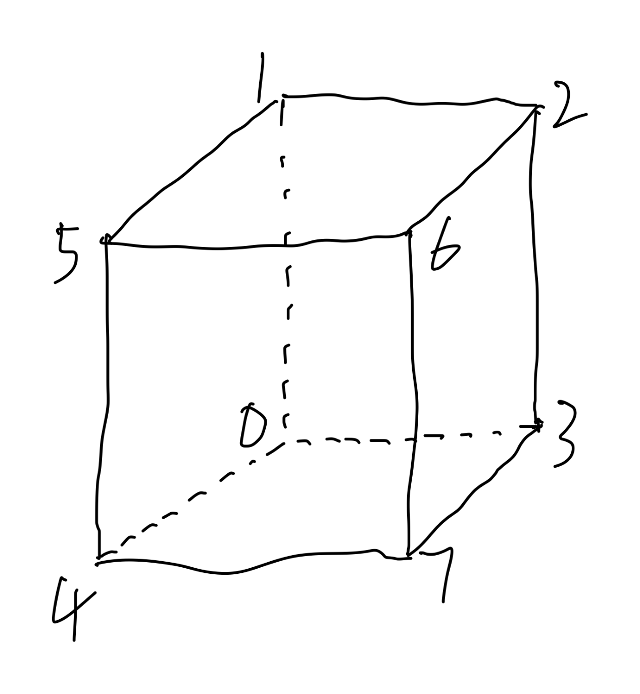

# 绘制多个图形

用相同的顶点数据绘制两个立方体，调用多次绘制方法。

## 着色器代码

- 顶点着色器

```glsl
attribute vec4 a_f_pos;
attribute vec4 a_f_color;
varying vec4 v_color;

uniform vec2 u_2fv_angle;	// 旋转角度
uniform vec4 u_4fv_transform_x;	// x 方向移动

void main() {
  // x 轴旋转角度转化为弧度值
  float xRadian = radians(u_2fv_angle.x);
  float xCos = cos(xRadian);
  float xSin = sin(xRadian);

  mat4 rotationXMatrix = mat4(1.0, 0, 0, 0.0, 0.0, xCos, -xSin, 0.0, 0.0, xSin, xCos, 0.0, 0.0, 0.0, 0.0, 1.0);

  // y 轴旋转角度转化为弧度值
  float yRadian = radians(u_2fv_angle.y);
  float yCos = cos(yRadian);
  float ySin = sin(yRadian);

  mat4 rotationYMatrix = mat4(yCos, 0.0, ySin, 0.0, 0.0, 1, 0.0, 0.0, -ySin, 0.0, yCos, 0.0, 0.0, 0.0, 0.0, 1.0);

  gl_Position = rotationXMatrix * rotationYMatrix * a_f_pos + u_4fv_transform_x;

  v_color = a_f_color;
}

```

顶点着色器中定义了立方体绕 x 轴与 y 轴进行旋转，同时接收`u_4fv_transform_x`来表示在 x 轴方向上的平移。

- 片段着色器

```glsl
// 所有float类型数据的精度是lowp
precision lowp float;
// 接收顶点着色器中v_color数据
varying vec4 v_color;
void main() {
  // 插值后颜色数据赋值给对应的片元
  gl_FragColor = v_color;
}
```

## js 代码

在本示例中，我们使用顶点索引来绘制图形，顶点索引可以复用缓存区中的数据，所以声明顶点的坐标数量只需要 8 个，然后用索引的方式来组合绘制就可以了。其中 0~3 这几个点是立方体的背面的几个点，4-7 这几个点是立方体朝向观察者的这一面的几个点。


1. 在 js 代码中，向 WebGL 缓冲区写入顶点坐标与颜色数据

```js
setAttribute(gl, program, {
  name: "a_f_pos",
  data: new Float32Array([
    // 第0个点
    -0.2, -0.2, 0.2,
    // 第1个点
    -0.2, 0.2, 0.2,
    // 第2个点
    0.2, 0.2, 0.2,
    // 第3个点
    0.2, -0.2, 0.2,

    // 第4个点
    -0.2, -0.2, -0.2,
    // 第5个点
    -0.2, 0.2, -0.2,
    // 第6个点
    0.2, 0.2, -0.2,
    // 第7个点
    0.2, -0.2, -0.2,
  ]),
  size: 3,
  normalized: false,
  stride: 0,
  offset: 0,
});

setAttribute(gl, program, {
  name: "a_f_color",
  data: new Float32Array([
    // 第0个点
    1, 1, 1,
    // 第1个点
    1, 1, 0,
    // 第2个点
    1, 0, 0,
    // 第3个点
    1, 0, 1,
    // 第4个点
    0, 1, 1,
    // 第5个点
    0, 0, 1,
    // 第6个点
    0, 1, 0,
    // 第7个点
    0, 0, 0,
  ]),
  size: 3,
  normalized: false,
  stride: 0,
  offset: 0,
});
```

2. 所以需写入索引数据到缓冲区，0，1，3 表示用第 0、1、3 这几个点绘制一个三角形，根据这样的规律，我们就可以绘制出立方体的各个面了。

```js
// 顶点索引数组
const indexes = new Uint8Array([
  // 绘制立方体四个侧面
  // 绘制一个面
  0, 1, 3, 1, 2, 3,

  3, 2, 7, 2, 6, 7,

  7, 6, 4, 4, 5, 6,

  4, 0, 5, 5, 1, 0,

  // 绘制顶面和底面
  0, 4, 3, 3, 4, 7,

  1, 2, 5, 2, 5, 6,
]);

// 创建缓冲区对象
const indexesBuffer = gl.createBuffer();
gl.bindBuffer(gl.ELEMENT_ARRAY_BUFFER, indexesBuffer);
gl.bufferData(gl.ELEMENT_ARRAY_BUFFER, indexes, gl.STATIC_DRAW);
```

3. 绘制图形到画布上

```js
let r = 0;
function draw() {
  // 清理画布
  gl.clearColor(0, 0, 0, 1);
  gl.clear(gl.COLOR_BUFFER_BIT | gl.DEPTH_BUFFER_BIT);

  setUniform(gl, program, {
    name: "u_2fv_angle",
    data: [r, r],
  });

  r += 1;
  if (r > 360) {
    r -= 360;
  }

  setUniform(gl, program, {
    name: "u_4fv_transform_x",
    data: [0.5, 0, 0, 0],
  });

  //开始绘制图形
  gl.drawElements(gl.TRIANGLES, 36, gl.UNSIGNED_BYTE, 0);

  setUniform(gl, program, {
    name: "u_4fv_transform_x",
    data: [-0.5, 0, 0, 0],
  });

  gl.drawElements(gl.TRIANGLES, 36, gl.UNSIGNED_BYTE, 0);

  requestAnimationFrame(() => draw());
}

draw();
```

### 示例效果

[绘制多个图形](./demo.html)
