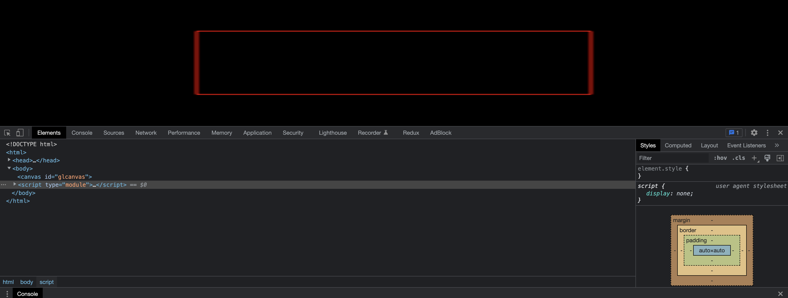
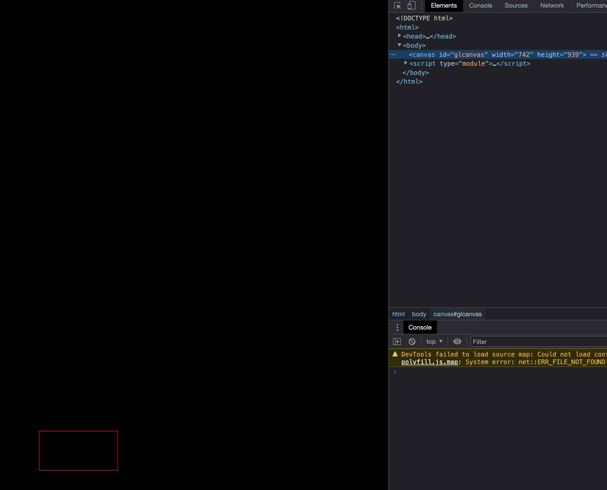

# 裁剪空间与像素空间

本文介绍如何把像素空间映射到裁剪空间，做映射的目的是为了便于我们描述坐标。

## 画布尺寸

每个画布都有两个尺寸，一个是绘制的`drawingBuffer`尺寸， 这个表示画布中有多少个像素。另一是画布显示的尺寸， CSS 决定画布显示的尺寸。

绘制尺寸可以通过 HTML 与 js 设置：

```html
<!-- 通过 HTML 标签属性设置 -->
<canvas id="canvas" width="400" height="400"></canvas>
<script>
  // 通过js设置宽高
  const $canvas = document.querySelector('#canvas')
  $canvas.width = 400
  $canvas.height = 400
</script>
```

## 裁剪空间

WebGL 渲染的空间的坐标为 -1 至 +1

## 像素空间

空间坐标使用像素值描述

## 裁剪空间与像素空间映射

裁剪空间与像素空间映射可以理解为，把裁剪空间-1 至+1 的坐标值转换为一个像素范围，例如-1 至 +1 转换为 -100px 至 +100px。通常会把裁剪空间映射为画布大小范围的。

## 绘制一个正方形

[在线预览](./demo1.html)

1. 设置 canvas 的大小为整个窗口的大小

```css
#glcanvas {
  display: block;
  width: 100%;
  height: 100%;
}
```

2. 调整窗口大小，我们可以看到正方形并不是正方形，并且宽度方向的边与高度方向的边粗细也不一样。
   

出现这种现象的原因是，在 chrome 中，canvas 默认宽高为 300x150，因为使用 css 设置了 canvas 宽高，导致 canvas 被拉伸了。

## 设置画布的绘制尺寸

1. 修改前面示例中的代码

```js
function draw() {
  if ($glcanvas.width !== $glcanvas.clientWidth || $glcanvas.height !== $glcanvas.clientHeight) {
    $glcanvas.width = $glcanvas.clientWidth
    $glcanvas.height = $glcanvas.clientHeight
  }

  // 清理画布
  gl.clearColor(0, 0, 0, 1)
  gl.clear(gl.COLOR_BUFFER_BIT | gl.DEPTH_BUFFER_BIT)

  // 开始绘制图形
  gl.drawArrays(gl.LINE_LOOP, 0, 4)

  requestAnimationFrame(draw)
}
```

2. 我们可以看到绘制的正方形在页面的左下角很小一块地方
   

这是因为我们还需要设置[gl.viewport](https://developer.mozilla.org/zh-CN/docs/Web/API/WebGLRenderingContext/viewport),画布默认 viewport 为初始化时 canvas 的绘制尺寸。当画布绘制尺寸改变时，同时也要设置 viewport 才生效。`gl.viewport` 告诉 WebGL 如何将裁剪空间（-1 到 +1）中的点转换到像素空间。

我们可以通过如下代码去设置 viewport

```js
gl.viewport(0, 0, $glcanvas.clientWidth, $glcanvas.clientHeight)
// 或者
gl.viewport(0, 0, gl.drawingBufferWidth, gl.drawingBufferHeight)
```

关于使用 `clientWidth/clientHeight`与`drawingBufferWidth/drawingBufferHeight` 的区别参考：https://webglfundamentals.org/webgl/lessons/zh_cn/webgl-anti-patterns.html#drawingbuffer，可按情况选择使用。

设置 viewport 后，我们改变窗口大小，可以看到正方形并不是正方形，只是边的粗细不会像[示例 1](./demo1.html)一样了。

[设置画布的绘制尺寸后的效果](./demo2.html)
