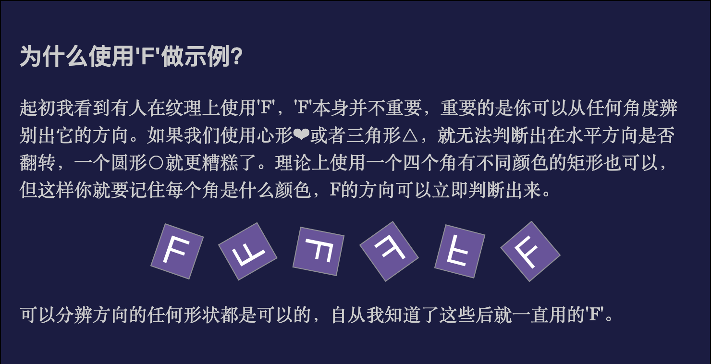

# 绘制三维字母 F

在 WebGL 中绘制一个立体的字母 F，并且把像素空间与裁剪空间进行转换，同时实现三维的移动与旋转。

至于为什么要绘制字母 F，原因如下：


## 着色器代码

- 顶点着色器

```glsl
attribute vec4 a_f_position;
uniform mat4 u_m4fv_transform;

void main() {
  gl_Position = u_m4fv_transform * a_f_position;
}
```

- 片段着色器

```glsl
void main() {
  gl_FragColor = vec4(0.0, 0.8, 1.0, 1.0);
}
```

着色器内容非常简单，顶点着色器接收一个矩阵和坐标位置，并把坐标与矩阵相乘，片段着色器指定了顶点颜色为蓝色。

## js 代码

在 JS 代码中，我们指定了字母 F 相关顶点的坐标，具体坐标值可到[源码](./vert.js)中查看

```js
setAttribute(gl, program, {
  name: 'a_f_position',
  // 正方形的顶点坐标
  data: new Float32Array(vert),
  size: 3,
  normalized: false,
  stride: 0,
  offset: 0
})
```

然后主要的就是 draw 方法了，在 draw 方法中，先声明了单位矩阵，然后通过`project`方法实现像素空间与裁剪空间转换，同时根据位移、旋转值，对矩阵进行选择，以获得最终的矩阵，最后传递给顶点着色器。最终代码如下：

```js
function draw() {
  if ($glcanvas.width !== $glcanvas.clientWidth || $glcanvas.height !== $glcanvas.clientHeight) {
    $glcanvas.width = $glcanvas.clientWidth
    $glcanvas.height = $glcanvas.clientHeight
    gl.viewport(0, 0, gl.drawingBufferWidth, gl.drawingBufferHeight)
  }

  // 单位矩阵
  let m = [1, 0, 0, 0, 0, 1, 0, 0, 0, 0, 1, 0, 0, 0, 0, 1]
  /**
   * 实现像素空间与裁剪空间的变换
   * x方向：-1~+1 对应的像素空间为 -$glcanvas.clientWidth / 2 ~ +$glcanvas.clientWidth / 2
   * y方向：-1~+1 对应的像素空间为 -$glcanvas.clientHeight / 2 ~ +$glcanvas.clientHeight / 2
   * z方向：-1~+1 对应的像素空间为 -50 ~ +50
   */
  m = project(m, $glcanvas.clientWidth, $glcanvas.clientHeight, 100)
  m = translate(m, x, y, z)
  m = xRotate(m, xRad)
  m = yRotate(m, yRad)
  m = zRotate(m, zRad)

  setUniform(gl, program, {
    name: 'u_m4fv_transform',
    data: m
  })

  // 清理画布
  gl.clearColor(0, 0, 0, 1)
  gl.clear(gl.COLOR_BUFFER_BIT | gl.DEPTH_BUFFER_BIT)

  // 开始绘制图形
  gl.drawArrays(gl.TRIANGLES, 0, 96)

  requestAnimationFrame(draw)
}
```

`project`方法实际执行了一次缩放，代码如下：

```ts
export function project(m: number[], width: number, height: number, depth: number) {
  return scale(m, 2 / width, 2 / height, 2 / depth)
}
```

## 示例效果

[查看示例效果](./demo.html)
